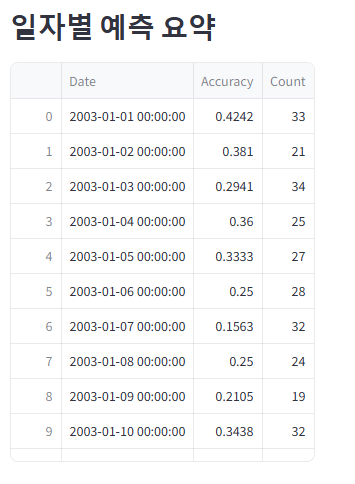
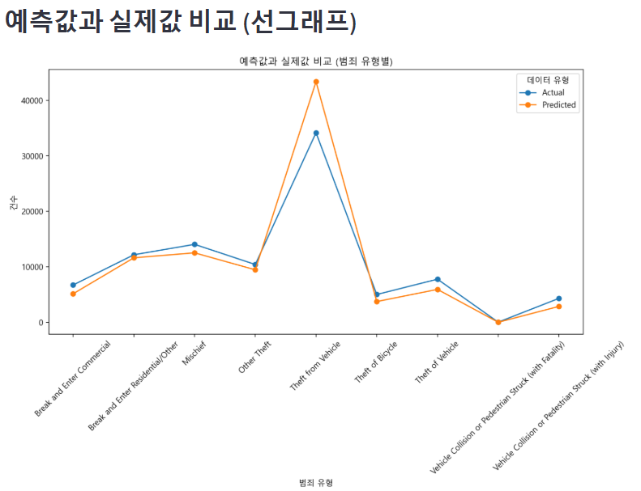
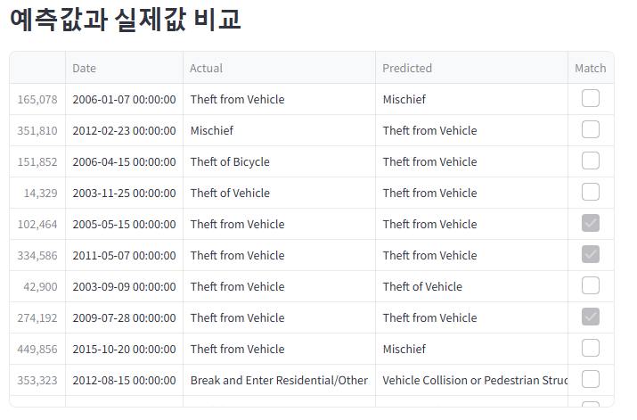

# Python 개인프로젝트

# 데이터기반 범죄 유형 예측 (AiCrime)

## 프로젝트 설명
데이터를 읽어와 범죄 유형을 예측하는 모델을 개발하는 프로젝트입니다. Streamlit을 활용하여 웹 인터페이스를 제공하며, 날짜, 시간대, 지역 정보를 기반으로 범죄 유형을 예측할 수 있습니다.

## 실행 화면

### 드롭다운 기반 범죄유형 예측
년도, 월, 일, 시간대(아침, 낮, 오후, 밤), 지역을 선택한 후 "예측하기" 버튼을 누르면 해당 조건에서 발생할 가능성이 높은 범죄 유형을 예측합니다.

- 범죄 유형 예측 실행후 (드롭다운에서 증상을 선택)

- 일자별 예측 요약

-예측값과 실제값 비교 선그래프

- 예측값 실제값 비교

## ⚙️ 사용 기술
- **프레임워크**: Streamlit
- **데이터 처리**: Pandas, NumPy
- **머신러닝 모델**: RandomForestClassifier (scikit-learn)
- **시각화**: Seaborn, Matplotlib

## 사용법
프로젝트를 클론합니다.

필요한 패키지를 설치합니다. -> pip install -r requirements.txt

Streamlit을 실행합니다. - > streamlit run S_AiCrime.py

웹 화면에서 드롭다운을 선택한 후 "예측하기" 버튼을 누르면 결과가 출력됩니다.
웹 화면에서 드롭다운을 양식에 맞게 선택후 예측하기 버튼을 누르면 예측값이 나옵니다.

## ⚠️ 주의사항
-데이터셋 (crime.csv)이 올바르게 위치해야 합니다 (dataset/ 폴더 내부에 저장).

-모델 학습 시간이 오래 걸릴 수 있습니다. 초기 실행 시 캐싱을 활용하여 성능을 최적화했습니다.

-예측 결과는 학습된 데이터 기반이며 100% 정확도를 보장하지 않습니다.

### 느낀점
-머신러닝 모델을 직접 학습시키고 Streamlit을 통해 배포해 보면서 AI 모델의 실제 적용 가능성을 체험할 수 있었습니다.

-데이터 전처리 및 시각화를 통해 범죄 발생 패턴을 분석하는 과정이 흥미로웠습니다.

### 향후 개선점
=데이터 스케일링 추가

=더 많은 피처 엔지니어링 적용 (날씨, 인구 밀도 등 추가 데이터 활용)

=모델 성능 개선 (하이퍼파라미터 튜닝 및 다른 알고리즘 비교)

=클라우드 배포 (Google Cloud 또는 AWS Lambda 활용)

