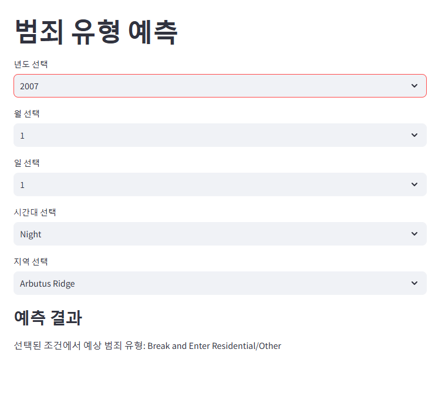
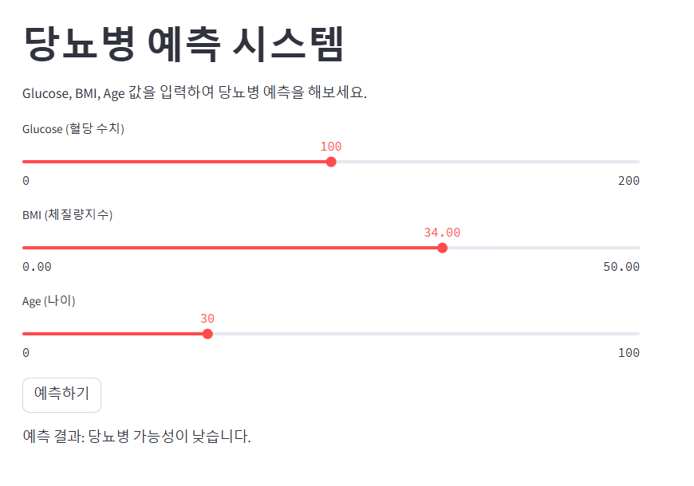
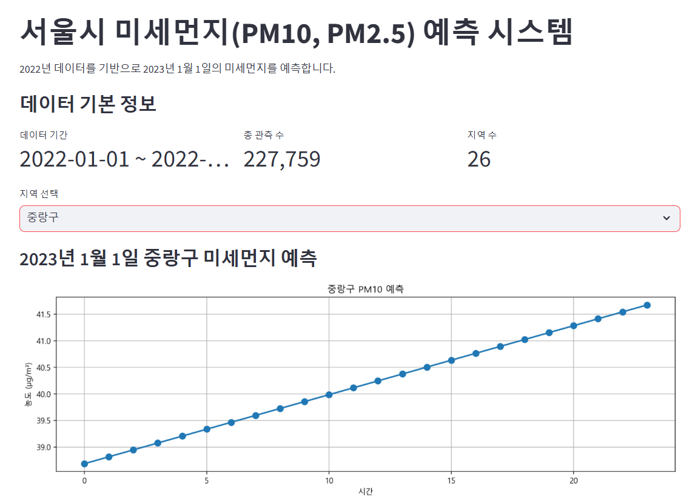

# 📌 파이썬 개인 프로젝트 미리보기  

본 저장소에는 다양한 파이썬 프로잭트가 포함되어 있습니다.  
각 프로젝트는 머신러닝 및 데이터 분석 기법을 활용하여 예측 모델을 구축하고, **Streamlit**을 사용해 웹 애플리케이션으로 구현되었습니다.  

## 🔗 프로젝트 목록  

- [🐈 고양이 질병 자가 진단 챗봇](#고양이-질병-자가진단-시스템)
- [🚔 범죄 유형 예측 시스템](#범죄-유형-예측-시스템) 
- [🩺 당뇨병 예측 시스템](#당뇨병-예측-시스템)  
- [📊 서울시 미세먼지 예측 시스템](#서울시-미세먼지-예측-시스템) 

---

## 🐈 고양이질병자가진단챗봇 (CatDiseaseChatbot)    

🔗 **[CatDiseaseChatbot 프로젝트로 이동](./CatDiseaseChatbot)** 

**설명**  
- 고양이의 증상을 입력하면 가능한 질병을 예측하고 대처 방법을 제시하는 챗봇 서비스입니다.  
- Taps을 사용하여 세 가지 모드를 한번에 제공합니다.
- 실시간 데이터 시각화 및 분석을 위해 **Streamlit**과 **gradio**를 활용하여 대시보드를 제공합니다.

  실행버전.png)

 

---

## 🚔 범죄 유형 예측 시스템 (Crime_Ai)    

🔗 **[Crime_Ai 프로젝트로 이동](./Crime_Ai)**

**설명**  
- 특정 지역에서 발생하는 범죄 데이터를 바탕으로 **머신러닝 분류 모델**을 사용하여 범죄 유형을 예측합니다.  
- 다양한 범죄 유형(절도, 폭력, 사기 등)을 학습하고, 주요 변수(시간대, 장소, 범죄 발생 패턴 등)를 분석하여 예측 정확도를 높입니다.  
- 실시간 데이터 시각화 및 분석을 위해 **Streamlit**을 활용하여 대시보드를 제공합니다.



  

---

## 🩺 당뇨병 예측 시스템 (diabetesPredict)    

🔗 **[diabetesPredict 프로젝트로 이동](./diabetesPredict)**

**설명**  
- **Pima Indians Diabetes Dataset**을 활용하여 혈당 수치(Glucose), 체질량지수(BMI), 나이(Age) 등을 입력하면 당뇨병 가능성을 예측합니다.  
- **랜덤 포레스트(Random Forest)** 분류 모델을 적용하여 높은 예측 정확도를 제공합니다.  
- **Streamlit** 기반 웹 애플리케이션을 통해 사용자 입력값을 받아 실시간으로 예측 결과를 제공합니다.



  

---

## 📊 서울시 미세먼지 예측 시스템 (미세먼지농도예측)    

🔗 **[미세먼지농도예측 프로젝트로 이동](./미세먼지농도예측)** 

**설명**  
- 서울시의 2022년 미세먼지(PM10, PM2.5) 데이터를 기반으로 2023년 1월 1일의 미세먼지 농도를 예측합니다.  
- **선형 회귀(Linear Regression)** 모델을 사용하며, **Streamlit**을 통해 웹 UI를 제공합니다.  
- 사용자가 특정 지역을 선택하면, 해당 지역의 시간대별 미세먼지 예측값을 그래프로 확인할 수 있습니다.



 

---

## 🚀 실행 방법  (파이썬 3.10버전 사용)

1. 필수 패키지 설치  
   ```bash
   pip install -r requirements.txt

2. Streamlit 실행
   ```bash
   streamlit run 파일명.py

## ⚠️ 주의할점

- 본 프로젝트들은 **Python 3.10 이상**에서 실행됩니다.
  다른 버전에서는 호환성 문제가 발생할 수 있습니다.
- 프로젝트 실행 전, `data` 폴더 내 데이터 파일이 존재하는지 확인하세요.
- 프로젝트 실행 시, 현재 경로를 프로젝트의 루트 디렉토리로 설정해야 합니다.
- 일부 머신러닝 모델 학습에는 **수 분**이 소요될 수 있습니다.

---


