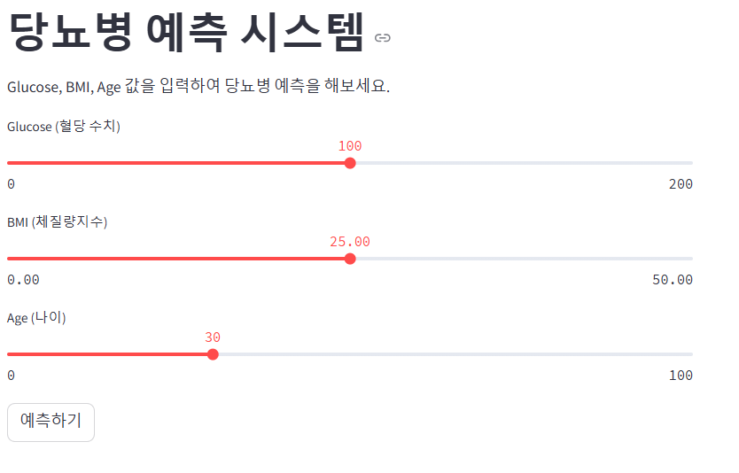
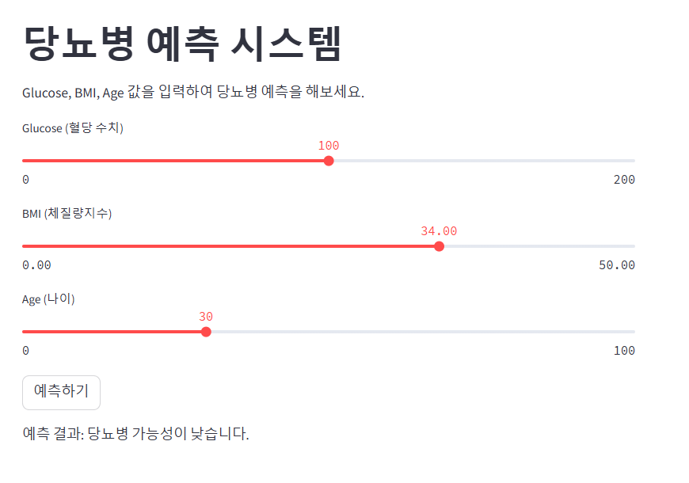

# Python 개인프로젝트

# 당뇨병 예측 시스템 (Diabetes Prediction)

## 프로젝트 설명
Glucose (혈당 수치), BMI (체질량지수), Age (나이) 데이터를 기반으로 당뇨병 여부를 예측하는 머신러닝 모델을 개발하고 Streamlit을 활용하여 웹 애플리케이션을 제작하였습니다.

## 실행 화면

### 사용자 입력 기반 당뇨병 예측
사용자가 Glucose, BMI, Age 값을 입력한 후 '예측하기' 버튼을 클릭하면 예측 결과가 출력됩니다.

- 실행 후 (예측 결과 표시)




## ⚙️ 사용 기술
- **프레임워크**: Streamlit
- **머신러닝 모델**: RandomForestClassifier (Scikit-Learn)
- **언어 처리**: Python
- **기타 라이브러리**: Pandas, NumPy, Joblib, Matplotlib

## 사용법

1. `dataset/diabetes.csv` 데이터를 준비합니다.
2. `streamlit_diabetes.py` 스크립트를 실행합니다.
3. 웹 애플리케이션이 실행되면, Glucose, BMI, Age 값을 입력한 후 '예측하기' 버튼을 클릭합니다.
4. 예측 결과가 화면에 표시됩니다.

```sh
streamlit run streamlit_diabetes.py
```

## ⚠️ 주의사항
- 모델 학습 후 `diabetes_model.pkl` 파일이 생성되어야 정상적으로 예측이 가능합니다.
- Streamlit 실행 시 필요한 라이브러리가 설치되어 있어야 합니다.

```sh
pip install pandas numpy scikit-learn joblib streamlit matplotlib
```

## 📌 향후 개선점
- 다양한 피처를 추가하여 예측 정확도를 개선
- 데이터 전처리 과정에서 이상치 처리 및 정규화 적용
- 시각적 요소를 추가하여 사용자 경험 향상
- 클라우드 환경에서 모델 배포 및 API 서비스화

---

프로젝트 관련 문의사항이 있다면 언제든지 연락주세요! 🚀

